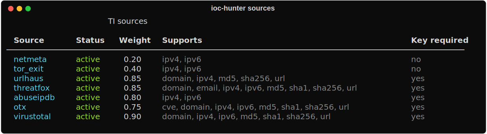
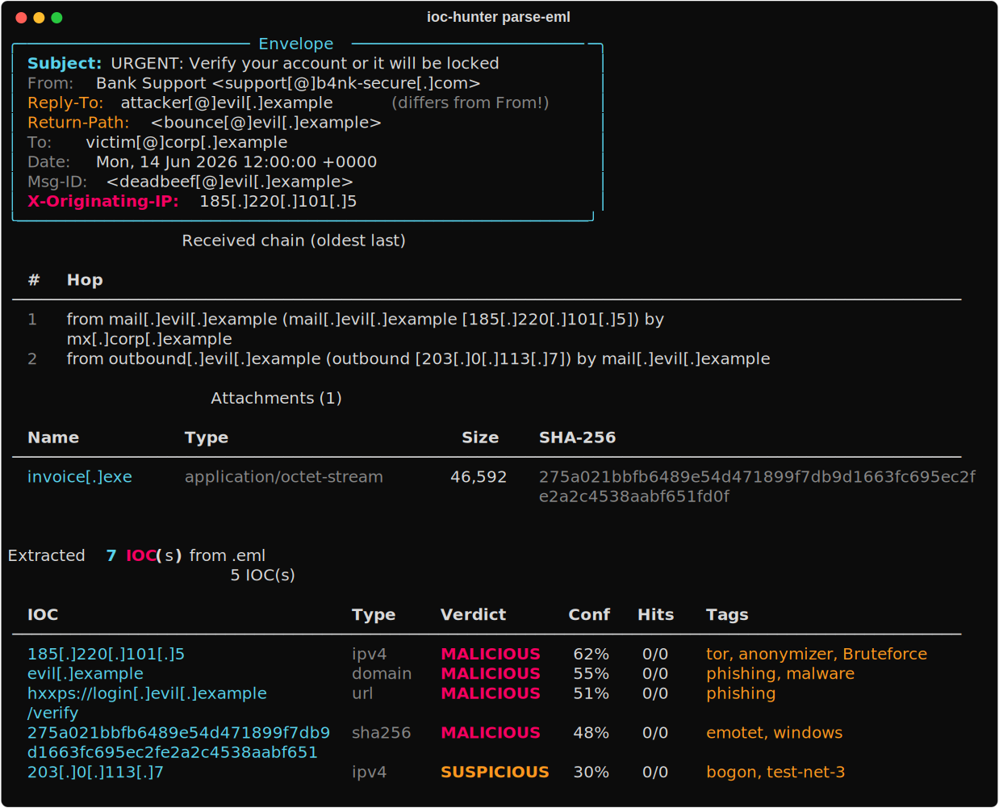
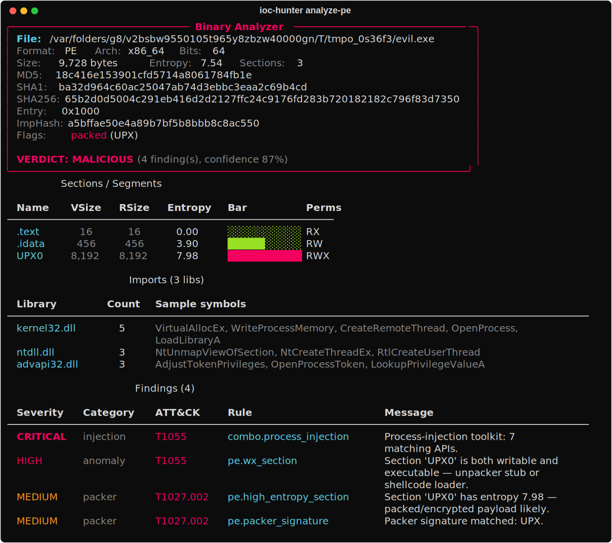
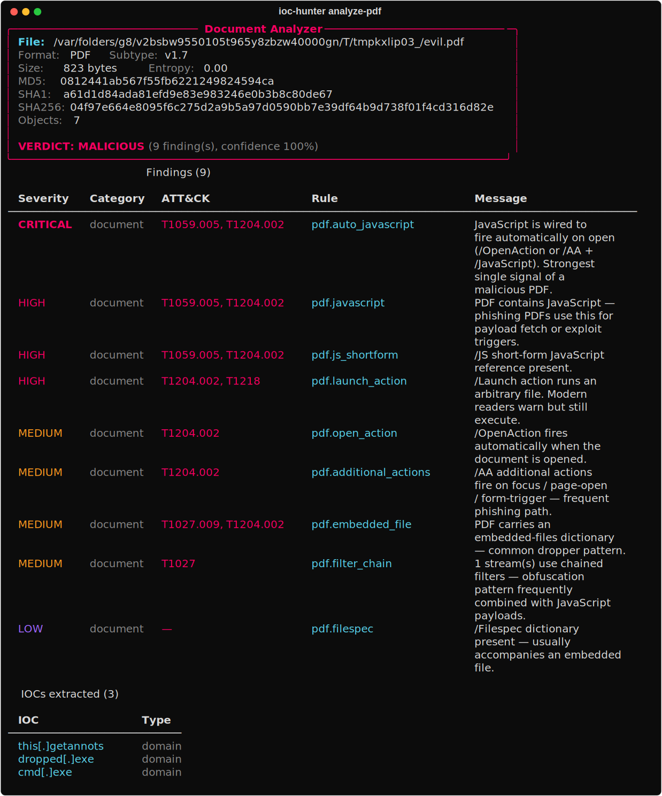
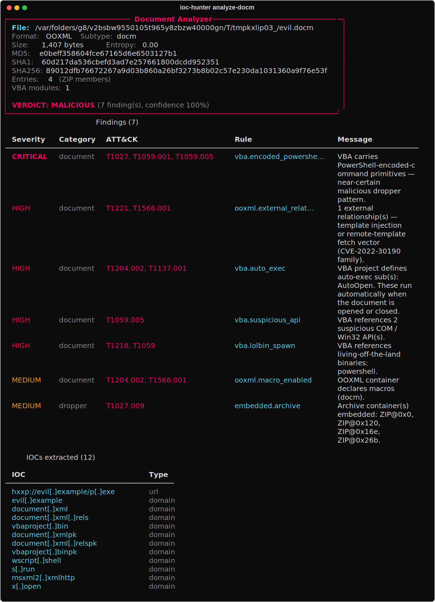
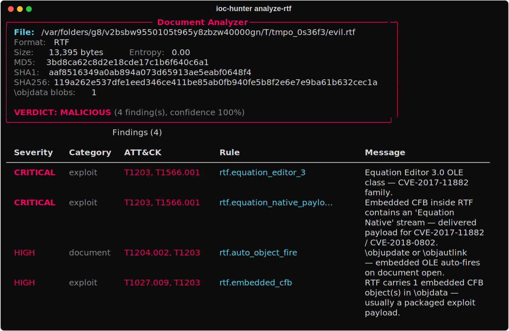
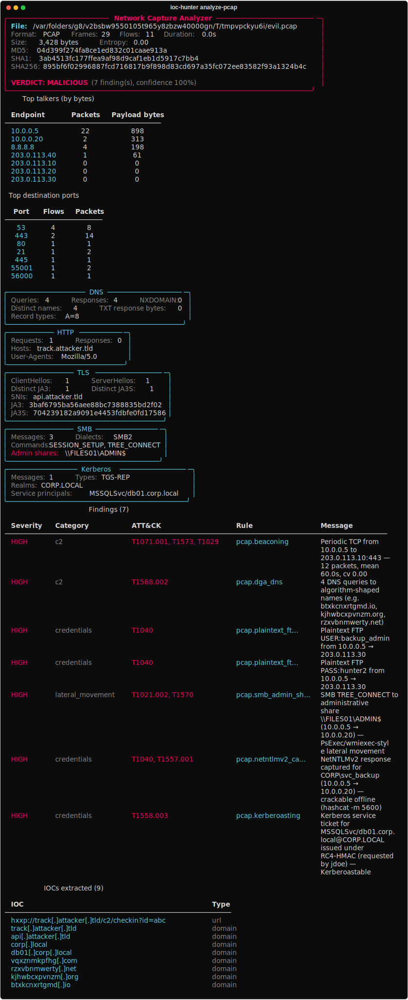
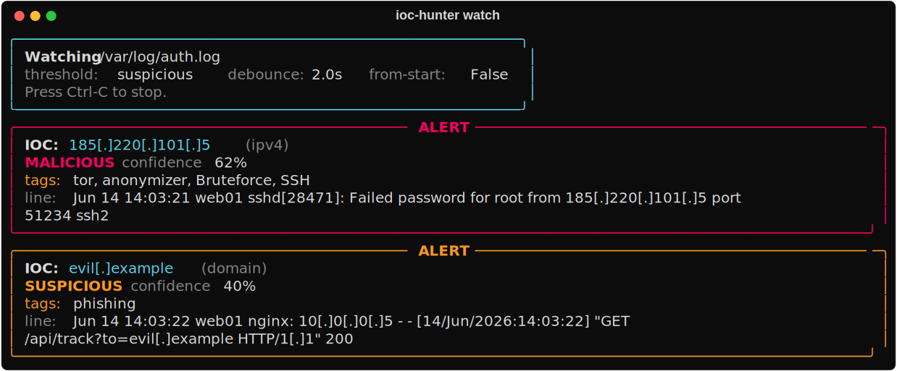

# IOC Hunter

> Async threat intelligence correlation engine for SOC analysts.
> Paste in a phishing report or .eml, tail a live log, get back verdicts
> from seven TI feeds, a correlation graph, and ready-to-deploy Sigma /
> Suricata / STIX / MISP.

[](https://github.com/platinum2high/ioc-hunter/actions/workflows/ci.yml)


---

## 🌐 Try it in the browser — no install

A paste-and-check web demo lives at the public Render deployment.
Paste any text, get back verdicts in real time. No signup, no
data retention, the rendered code is the same engine you run
locally.

**Deploy your own** in two clicks: see [`Self-host the web demo`](#self-host-the-web-demo)
below.

---

## ⚡ Works keyless out of the box

You don't need any API keys to try it. Two sources work immediately
with no signup, the other five register in under a minute each. See
[`Install`](#install) for the full walk-through.

- **Tor exit** — flags traffic from Tor relays
- **NetMeta** — offline classifier for bogon / private / CGNAT /
  reserved IP ranges (RFC 1918, RFC 5737, RFC 6598, RFC 6890). A
  `test-net` or `240/4` IP in a production log = misconfig or
  spoofed traffic.

Without keys, the keyed sources (URLhaus, ThreatFox, AbuseIPDB, OTX,
VirusTotal) return `UNKNOWN` with a clear "missing API key" message —
they don't crash, just gracefully skip.

---

## What it does that other IOC tools don't

| Capability | Most IOC checkers | IOC Hunter |
| --- | --- | --- |
| Input | one IOC at a time | drag in a whole report, paste `.eml`, or tail a live log |
| Defang-aware | usually no | `evil[.]com`, `hxxp://`, `[at]` all understood |
| Sources | 1 (usually VT) | 7 in parallel: VT, AbuseIPDB, OTX, URLhaus, ThreatFox, Tor exit, NetMeta |
| Phishing triage | none | `.eml` parser: From/Reply-To mismatch, Received chain, attachment hashes |
| Live monitoring | none | `watch` mode — tail a log, alert on suspicious IOCs in real time |
| Scoring | bad/good | transparent weighted model with per-source contribution |
| Output | terminal text | JSON, Markdown, **STIX 2.1**, **MISP**, **Sigma**, **Suricata** |
| Correlation | none | shared-subnet + shared-tag pivots across the batch |
| Decoding | none | base64 / hex / URL / JWT / gzip / zlib + magic auto-detect |
| Cache | none | SQLite with TTL — survives across runs, doesn't burn API quota |
| Binary forensics | none | static PE / ELF / Mach-O analyzer: ImpHash, Authenticode, entitlements, embedded payloads, ATT&CK techniques |
| Document forensics | none | PDF / OOXML / OLE / RTF analyzer: PDF actions, MS-OVBA decompressor, Follina/template-injection, Equation Editor (CVE-2017-11882), OLE2Link (CVE-2017-0199), embedded payload extraction |
| Network forensics | tcpdump-only | PCAP / PCAPNG analyzer: 5-tuple flows + top-talkers, DNS dissection, HTTP plaintext, **TLS ClientHello + JA3 fingerprint**, beaconing detection, DGA-shape DNS, DNS-tunneling, port scans, one-sided exfil, plaintext-credential leaks, ICMP tunnel |

---

## Install

### 1. Clone and create a virtualenv

```bash
git clone https://github.com/platinum2high/ioc-hunter
cd ioc-hunter
python -m venv .venv
source .venv/bin/activate            # Windows: .venv\Scripts\activate
```

### 2. Install the package

```bash
pip install -e .
```

This pulls in 4 runtime dependencies (`httpx`, `typer`, `rich`,
`python-dotenv`) and gives you the `ioc-hunter` command in your shell.

### 3. (Optional) Add API keys

You can skip this and the tool still works — only the Tor-exit feed
will run. To unlock the other 5 feeds, all free:

| Source | Register | Adds support for |
| --- | --- | --- |
| **abuse.ch Auth-Key** (URLhaus + ThreatFox) | <https://auth.abuse.ch/> | URLs, domains, IPs, hashes, emails |
| **AbuseIPDB** | <https://www.abuseipdb.com/register> | IPv4/IPv6 reputation |
| **AlienVault OTX** | <https://otx.alienvault.com/> | IPs, domains, URLs, hashes, CVEs |
| **VirusTotal** | <https://www.virustotal.com/> | IPs, domains, URLs, hashes |

Registration on each is ~30 seconds. Then run the interactive setup:

```bash
ioc-hunter configure
```

It walks through each key with the registration URL, writes a local
`.env` (gitignored), leaves untouched keys alone.

### 4. Verify the install

```bash
ioc-hunter sources
```



Sources marked `missing key` would show as yellow and skip with a clear
message at runtime — not crash. You can run with as few as one (the
keyless Tor feed).

---

## Run it with Docker

```bash
cp .env.example .env             # fill in any keys you have
docker compose run --rm ioc-hunter check evil[.]com
```

The image is multi-stage (non-root runtime, ~120 MB), the SQLite cache is
mounted as a volume so it survives across containers.

---

## Commands

```
ioc-hunter check <ioc>                       single IOC verdict
ioc-hunter scan-file <path>                  extract + enrich every IOC in a file
ioc-hunter parse-eml <path>                  phishing .eml — headers, body, attachments
ioc-hunter analyze <path>                    static analysis of PE / ELF / Mach-O / PDF / OOXML / OLE / RTF / PCAP / PCAPNG
ioc-hunter watch <path>                      tail a log file and alert on suspicious IOCs
ioc-hunter correlate <path>                  shared-infra and shared-tag pivots
ioc-hunter report <path> --format <fmt>      json | md | stix | misp | sigma | suricata
ioc-hunter decode <text> [--op <name>]       base64 / hex / URL / JWT / gzip / ... (magic by default)
ioc-hunter sources                           list configured sources
ioc-hunter configure                         interactive .env wizard
```

Global flags: `--version`, `--help`. Per-command: `--no-cache` for fresh
lookups.

---

## Demo with real output

### Single IOC — defanged in, defanged out

```bash
ioc-hunter check "185[.]220[.]101[.]42" --no-cache
```


That's a real Tor exit relay — flagged by 4 of 6 sources, with country,
ISP, and attack-pattern tags. Confidence is shown explicitly so you can
defend the verdict in a ticket.

### Scan a whole report

`examples/sample-incident.txt` is included in the repo:

```bash
ioc-hunter scan-file examples/sample-incident.txt --no-cache
```


Note: every IOC is **defanged on output** so you can't accidentally
click `evil.com` from your terminal. They were also defanged on input
(`185[.]220[.]101[.]42`, `hxxps://`, `bad[at]evil[.]com`) — refanging
is automatic.

### Triage a phishing `.eml`

```bash
ioc-hunter parse-eml suspicious.eml
```



The envelope panel flags **Reply-To ≠ From** and surfaces
**X-Originating-IP** explicitly — both classic phishing tells.
The Received chain reveals the real MTA hops. Attachments are
hashed (SHA-256 + MD5) and their hashes flow straight into the TI
lookups along with body URLs, header IPs, and quoted domains.

Add `--no-enrich` for an offline-only parse (no TI calls).

### Analyze a suspicious binary

```bash
ioc-hunter analyze ./sample.exe
```



A pure-Python static analyzer for **PE / ELF / Mach-O** — no `pefile`, no
`lief`, no external services. One header, one verdict, then a finding
list mapped to **MITRE ATT&CK** techniques.

What it pulls in a single pass:

- **PE**: sections + entropy, imports + **ImpHash** (Mandiant pivot),
  Authenticode signer / issuer CN, VERSIONINFO, manifest
  (`requestedExecutionLevel`, `autoElevate`, `uiAccess`), embedded PEs in
  resources, entry-point sanity, PE checksum recompute, timestamp
  anomalies
- **ELF**: program headers, dynamic imports, `.note.gnu.build-id`,
  `.note.go.buildid`, ABI tag, RWX segments, stripped detection
- **Mach-O**: fat-slice walker, load commands, CodeDirectory
  (identifier + team-id + flags), parsed XML **entitlements** with
  risky-capability classification
- **Cross-format**: nested PE / ELF / Mach-O / ZIP / 7z / RAR / gz scan,
  msfvenom + egghunter + Donut + Cobalt Strike beacon detection
  (incl. XOR-0x69 / 0x2E variants), Go marker, packer fingerprinting
  (UPX, MPRESS, ASPack, …)

Heuristics fire suspicious-API combos (`VirtualAllocEx` +
`WriteProcessMemory` + `CreateRemoteThread` → **T1055**), RWX sections,
debug strings, mismatched extensions. Each finding carries a severity,
a one-line rationale, and (where applicable) ATT&CK technique IDs.

Flags:

- `--json` — full structured report (Jira / SIEM-ready)
- `--md` — Markdown summary for tickets and Slack
- `--strings` — preview of extracted printable strings
- `--no-enrich` — skip TI lookups on embedded IOCs

### Analyze a suspicious document

`ioc-hunter analyze` also handles **PDF / OOXML / OLE / RTF** with the
same single command. The dispatcher autodetects the format from magic
bytes and routes to a dedicated parser — all pure Python, no
`pdfminer`, no `olefile`, no `python-docx`, no `oletools`.

```bash
ioc-hunter analyze quarterly-report.pdf
ioc-hunter analyze suspicious.docm
ioc-hunter analyze legacy.doc
ioc-hunter analyze invoice.rtf
```

**PDF**:



- `xref` table + indirect-object walker; falls back to a regex scan
  on tampered xrefs (real malicious PDFs break them on purpose)
- Action keys: `/JavaScript`, `/Launch`, `/OpenAction`, `/AA`,
  `/EmbeddedFile`, `/RichMedia`, `/JBIG2Decode`, `/GoToR`,
  `/SubmitForm`, `/URI`
- **Auto-fire escalation**: `/OpenAction` or `/AA` combined with
  `/JavaScript` → CRITICAL — strongest single signal of a malicious PDF
- `FlateDecode` streams are zlib-decompressed; URLs hidden inside
  JavaScript bodies flow into the TI sweep

**OOXML** (.docm / .xlsm / .pptm / docx / xlsx / pptx):



- ZIP walker via stdlib `zipfile`; subtype detection from
  `[Content_Types].xml`
- **External relationships**: scans `*_rels/*.xml.rels` for
  `TargetMode="External"` + dangerous types (attachedTemplate,
  oleObject, frame, subDocument, …) — Follina /
  **CVE-2022-30190** / template-injection IOC
- `ms-msdt:` / `ms-search-ms:` URI schemes → CRITICAL
- DDE-in-`sharedStrings.xml` (`=cmd|`, `=DDEAuto`)
- `vbaProject.bin` extracted and handed to the VBA analyzer

**OLE / CFB** (legacy .doc, .xls, .ppt, .msi, bare `vbaProject.bin`):

- Full **MS-CFB parser**: 512-byte header, FAT chain with DiFAT
  extension, directory red-black-tree walker (UTF-16LE names),
  MiniFAT for streams under 4 KiB
- Subtype detection: `.doc` (WordDocument stream), `.xls` (Workbook),
  `.ppt` (PowerPoint Document), `.msi` (`!_StringPool` + `_Tables`),
  bare `vbaProject.bin`
- **`Equation Native` stream** detection → CVE-2017-11882 / CVE-2018-0802
- Suspicious CLSIDs (Equation Editor, Packager)
- `\x01Ole10Native` Packager-based file drops

**RTF**:



- `\object` + `\objclass` walker recognises the exploit classes:
  - **`Equation.3`** → CVE-2017-11882 (CRITICAL)
  - **`Equation.2`** → CVE-2018-0802
  - **`OLE2Link`** → CVE-2017-0199 (CRITICAL)
  - **`Package`** → legacy file-launcher dropper
- `\objupdate` / `\objautlink` → auto-fire trigger on document open
- `\objdata` hex blob → decoded → if it's a CFB, we recurse with the
  OLE analyzer and surface embedded `Equation Native` payloads as a
  separate CRITICAL finding
- `\objocx` ActiveX embedding, `\bin` raw-binary inclusion

**VBA decompressor** ([MS-OVBA] §2.4.1):

- Full **CompressedAtom decoder**: chunk-header signature bit + type
  bits + size-minus-three field; literal/copy token machinery with
  the bit-count split derived per decompressed position
- PerformanceCache prefix skip via signature-byte scan (no need to
  parse the `dir` stream)
- Heuristics on decoded VBA source:
  - **Auto-exec subs** (`AutoOpen`, `Workbook_Open`, `Document_Open`,
    …) → HIGH, T1204.002 + T1137.001
  - **Suspicious COM bridges** (`WScript.Shell`, `MSXML2.XMLHTTP`,
    `ADODB.Stream`, `WinHttp.WinHttpRequest`, …) → HIGH, T1059.005
  - **LOLBin spawn** (`powershell`, `mshta`, `rundll32`, `regsvr32`,
    `certutil`, `bitsadmin`, …) → HIGH, T1218 + T1059
  - **Encoded-PowerShell markers** (`-enc`, `FromBase64String`,
    `DownloadString`, …) → CRITICAL, T1027 + T1059.001
  - **Obfuscation primitive density** (`Chr`/`StrReverse`/`Asc`) → MEDIUM

Every doc finding is mapped to MITRE ATT&CK by the same tagger used
for binaries — `analyze --json` and `--md` both render the techniques
inline.

### Analyze a packet capture

`ioc-hunter analyze` also handles **PCAP** and **PCAPNG**. Same one
command, autodetected from magic bytes, routed to a hand-rolled parser
— pure Python, no `scapy`, no `dpkt`, no `pyshark`, no `tshark`.

```bash
ioc-hunter analyze suspicious-traffic.pcap
ioc-hunter analyze hunt-sample.pcapng
```



**Container + L2-L4 dissection**

- libpcap classic (microsecond *and* nanosecond timestamps, both
  endiannesses) and PCAPNG (Section Header / Interface Description /
  Enhanced + Simple Packet Block walker — unknown block types are
  skipped via `block_total_length`, so we keep going on captures other
  tools choke on)
- Ethernet II, **802.1Q VLAN** (one nesting) + QinQ, Linux SLL v1/v2,
  BSD NULL/LOOP, RAW IP
- IPv4 with IHL-correct options skip, **IPv6 with extension-header
  chain walked** to the transport
- TCP / UDP / ICMP / ICMPv6 — every offset bounds-checked, malformed
  records yield a degraded report rather than a stack trace

**Flow aggregation**

- Bidirectional 5-tuple flows with per-direction packet and **payload-
  byte** counters, top-talkers, top destination ports
- The initiator is whichever side sent the first SYN (or the first
  packet if there is no SYN) — so `a_ip → b_ip` always reads from
  client to server

**Application layer**

- **DNS** — UDP/53 + TCP/53 (length-prefixed). QNAME decoder with
  pointer-loop protection (hop cap, total-length cap). Per-name
  aggregation tracks query count, NXDOMAIN count, TXT response bytes —
  the inputs the heuristics layer reads
- **HTTP plaintext** — opportunistic per-direction stream stitching
  (capped, never full TCP reassembly — that's a bigger project) so
  headers spanning multiple segments still parse. Extracts Method /
  Host / URI / User-Agent / Server / Status. Flags HTTP **Basic-auth
  headers** in cleartext as a credential leak. Known-malicious UA
  patterns (Emotet `Mozilla/4.0`, Sliver, BITSAdmin, empty UAs, …)
  raise their own finding
- **TLS ClientHello** — record-layer + handshake walker for the first
  ClientHello per direction. Extracts SNI, advertised cipher list,
  extensions, supported groups, EC point formats, ALPN. Computes the
  **JA3 fingerprint** per the published spec — GREASE values stripped,
  hex MD5 over `SSLVersion,Cipher,Extension,EllipticCurve,EllipticCurvePointFormat`

**Behavioural heuristics** — the part that catches *brand-new* implants
where static IOCs don't

- **Beaconing** — periodic client→server intervals scored on the
  coefficient of variation (stddev / mean). Cobalt Strike defaults sit
  around 0.1–0.2; benign keepalives drift past 0.4. Surfaces flow,
  mean interval, packet count
- **DGA-shaped DNS** — entropy + consonant-cluster check on the 2LD
  label, with a known-compound-TLD table so `ministry.gov.uk` correctly
  resolves to `ministry`, not `gov`. Single hits log INFO; ≥3 in one
  capture fire HIGH
- **DNS tunneling** — aggregate TXT-response volume + per-2LD query
  rate; both signals separately flagged, the combo flips the verdict
- **NXDOMAIN ratio ≥50%** of responses — classic DGA churn, fires
  MEDIUM
- **Port scan** (one src → one dst, many ports) and **host sweep**
  (one src → many dst, one port), keyed off TCP SYN-without-ACK so
  server-side SYN+ACK responses don't trigger false positives
- **One-sided exfil** — ≥256 KiB a→b with reverse traffic under 5% of
  outbound. Classic HTTP POST / unauth upload tell
- **ICMP tunnel** — large ICMP-echo payloads (≥64 B past the header)
  sustained over ≥20 packets per (src, dst). Real ping isn't this
  noisy
- **Plaintext FTP USER/PASS** + **HTTP Basic-auth** — every credential
  on the wire surfaces as its own HIGH finding

**MITRE ATT&CK mapping**

| Rule | Technique |
| --- | --- |
| `pcap.beaconing` | T1071.001, T1573, T1029 |
| `pcap.dga_dns` / `pcap.high_nxdomain_ratio` | T1568.002 |
| `pcap.dns_tunneling_*` | T1071.004, T1572 |
| `pcap.port_scan` | T1046 |
| `pcap.host_sweep` | T1018 |
| `pcap.unidirectional_exfil` | T1041, T1567 |
| `pcap.icmp_tunnel` | T1095, T1572 |
| `pcap.plaintext_*` | T1040 |

Every PCAP finding flows through the same renderer as PE / PDF / RTF
findings; `--json` / `--md` carry the same fields. The dispatcher also
runs the global IOC sweep over the strings + extracted SNIs + DNS
names, so `analyze sample.pcap --no-enrich` already gives the analyst
the URL, domain, and IPv4 list with zero extra flags.

### Watch a log file live

```bash
ioc-hunter watch /var/log/auth.log --threshold suspicious
```



Tail-style polling with log-rotation handling (inode change or truncate
re-opens from the start). Bursts are debounced — a thousand-line spike
becomes one batched TI lookup, not a thousand. Alerts only fire for
verdicts at or above the configured threshold.

### Find cross-IOC pivots

```bash
ioc-hunter correlate examples/sample-incident.txt --no-cache
```


### Generate detection rules

```console
$ ioc-hunter report examples/sample-incident.txt --format sigma --no-cache

title: IOC Hunter - 1 malicious domain indicator(s)
id: 14ffc8c8-355c-402e-9920-69bab9d13546
status: experimental
description: Auto-generated from threat-intel verdicts on 2026/06/13.
date: 2026/06/13
references:
  - https://otx.alienvault.com/indicator/domain/evil.com
  - https://www.virustotal.com/gui/search/evil.com
author: ioc-hunter
logsource:
  category: dns
detection:
  selection:
    QueryName:
      - 'evil.com'
  condition: selection
level: high
tags:
  - malware
  - phishing
---
title: IOC Hunter - 2 malicious ipv4 indicator(s)
...
```

Same input also exports as `--format suricata`, `--format stix`,
`--format misp`, `--format json`, `--format markdown`.

### Magic decode

```bash
ioc-hunter decode "aHR0cHM6Ly9ldmlsLmNvbS9sb2dpbi5waHA="
```


The base64 candidate ranks first because the decoded text contains
extractable IOCs — IOC presence is a tiebreaker in the scoring.

Force a specific op: `--op base64`, `--op hex`, `--op url`, `--op jwt`,
`--op gzip`, `--op zlib`, `--op rot13`, `--op html`, `--op base32`.

---

## Self-host the web demo

The repo ships a FastAPI front (`src/ioc_hunter/web/`) and a Render
`render.yaml` Blueprint. Free tier is fine for a portfolio demo —
the dyno sleeps after 15 minutes of inactivity and wakes on the
next request (~30 s cold start).

### Run it locally

```bash
pip install -e ".[web]"
uvicorn ioc_hunter.web:app --host 0.0.0.0 --port 8000
# → http://localhost:8000
```

### Deploy to Render in 5 clicks

1. Push this repo to your GitHub.
2. <https://dashboard.render.com/> → **New +** → **Blueprint**.
3. Pick the `ioc-hunter` repo. Render auto-discovers `render.yaml`.
4. Click **Apply**. The Free service builds from `Dockerfile.web`.
5. *(Optional)* In the service → **Environment**, set any TI API
   keys you have (`ABUSE_CH_AUTH_KEY`, `ABUSEIPDB_API_KEY`,
   `OTX_API_KEY`, `VIRUSTOTAL_API_KEY`). Without them, the
   keyless sources (NetMeta + Tor exit) still work.

Every push to `main` redeploys automatically. Health endpoint at
`/healthz`, API docs at `/api/docs`.

### Built-in safety

- Hard rate limit (10 req/min per IP, configurable via env)
- Body cap (64 KB), text cap (32 KB), max 25 IOCs per scan
- No IOC retention — request data leaves no trace beyond the
  in-process cache, keyed by source/type/value only
- Security headers (`X-Content-Type-Options`, `X-Frame-Options`,
  `Referrer-Policy`)
- Trusts only the leftmost `X-Forwarded-For` value (Render's edge)
  for rate-limit bucketing — defeats trivial header spoofing

---

## Architecture

```
                   ┌───────────────┐
   raw text ─────▶│  parser/defang │
                   └──────┬────────┘
                          ▼
                   ┌───────────────┐    cache hit ──▶ result
                   │  SQLite cache │───┐
                   └──────┬────────┘   │ miss
                          ▼            ▼
            ┌──────────────────────────────────────┐
            │   async orchestrator (httpx)         │
            │   ┌────────┬────────┬────────┐       │
            │   │URLhaus │ OTX    │ VT     │  ...  │
            │   └────────┴────────┴────────┘       │
            └──────────────────┬───────────────────┘
                               ▼
                       ┌────────────────┐
                       │ weighted scorer│
                       └──────┬─────────┘
                              ▼
                       ┌────────────────┐
                       │  correlator    │
                       └──────┬─────────┘
                              ▼
              ┌────────────────────────────────┐
              │ exporters: JSON / MD /         │
              │           STIX / MISP          │
              │ rule gen:  Sigma / Suricata    │
              │ TUI dashboard                  │
              └────────────────────────────────┘
```

| Module | Role |
| --- | --- |
| `core/` | IOC extraction, defang/refang, type detection |
| `cache/` | TTL SQLite cache, gracefully shared across runs |
| `sources/` | Plugin per TI feed (one file each — add yours in 50 lines) |
| `engine.py` | Async orchestrator + semaphore-limited concurrency |
| `scorer.py` | Weighted confidence aggregation across sources |
| `correlator.py` | Shared-subnet / shared-tag / URL→host pivots |
| `exporters/` | JSON, Markdown, STIX 2.1, MISP Event |
| `rules/` | Sigma + Suricata generators with severity floor |
| `decoder/` | CyberChef-style operations + magic auto-detect |
| `analyze/` | Static PE / ELF / Mach-O / PDF / OOXML / OLE / RTF / PCAP / PCAPNG analyzer + MS-OVBA decompressor + JA3 fingerprinting + ATT&CK map |
| `cli.py` | Rich-powered terminal UI |

---

## TI Sources

| Source | Auth | Supports | Weight |
| --- | --- | --- | --- |
| URLhaus (abuse.ch) | Auth-Key (free) | URL, domain, IPv4, MD5, SHA256 | 0.85 |
| ThreatFox (abuse.ch) | Auth-Key (free) | URL, domain, IP, hashes, email | 0.85 |
| AbuseIPDB | API key (free 1k/day) | IPv4, IPv6 | 0.80 |
| AlienVault OTX | API key (free) | IPv4, IPv6, domain, URL, file, CVE | 0.75 |
| VirusTotal | API key (free 4/min) | IPv4, IPv6, domain, URL, file | 0.90 |
| Tor exit list | **none** | IPv4, IPv6 | 0.40 |
| NetMeta (offline) | **none** | IPv4, IPv6 | 0.20 |

Adding a source is one file: subclass `Source`, implement `async lookup()`,
import in `sources/__init__.py`. See `sources/tor_exit.py` for the
shortest possible example (40 lines).

---

## Status

All planned phases done.

| Phase | Status |
| --- | --- |
| 0 — project skeleton | ✅ |
| 1 — IOC parsing core | ✅ |
| 2 — TTL SQLite cache | ✅ |
| 3 — keyless TI sources | ✅ |
| 4 — keyed TI sources | ✅ |
| 5 — async engine + scorer | ✅ |
| 6 — CLI + Rich TUI | ✅ |
| 7 — JSON / Markdown / STIX / MISP exporters | ✅ |
| 8 — correlation graph | ✅ |
| 9 — Sigma / Suricata rule generation | ✅ |
| 10 — CyberChef-style decoder | ✅ |
| 11 — Docker, CI, README | ✅ |
| 12 — .eml parser, watch-mode, NetMeta source | ✅ |
| 13 — FastAPI web demo + Render Blueprint | ✅ |
| 14.1 — static PE / ELF / Mach-O analyzer + ATT&CK map | ✅ |
| 14.2a — PDF / OOXML / OLE analyzer + MS-OVBA decompressor + Follina detection | ✅ |
| 14.2b — RTF analyzer (Equation Editor, OLE2Link), OLE subtype detection, CLI polish | ✅ |
| 14.3a — PCAP / PCAPNG analyzer (flows, DNS/HTTP/TLS+JA3, beaconing, DGA, exfil, plaintext-creds) | ✅ |

**521 tests, all green.** CI runs the full matrix (Python 3.11 + 3.12),
Docker build, `ruff` lint + format check, and `gitleaks` secret scan on
every push.

---

## Security

API keys live in `.env`, which is gitignored. `gitleaks` runs on every
push to catch accidents. The Dockerfile builds a non-root runtime image.

If you find a vulnerability, please open a private security advisory
rather than a public issue.

---

## License

MIT — see [LICENSE](LICENSE).
